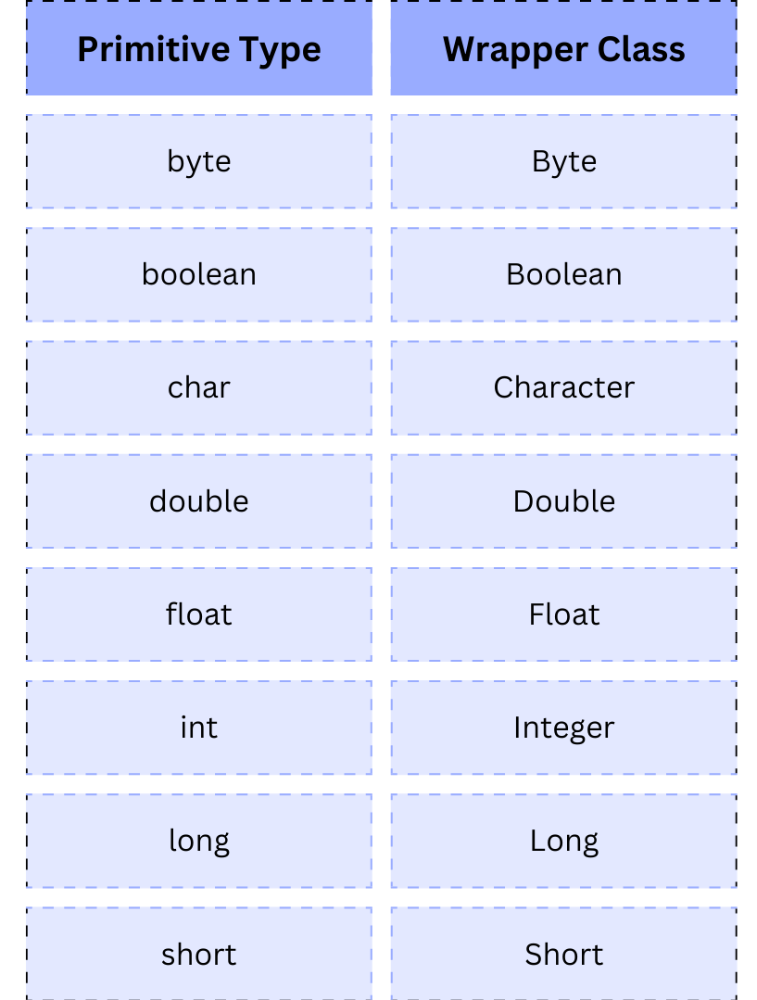

# Tipos

* Primitivos
* Por Referência

## Primitivos

* Armazenam apenas um valor.
* Não podem ser *null*
* Não possuem nenhuma característica, função associada
* Podem possuir ponto flutuante ou fixo

### INTEIROS:

* byte (1 byte): -128 a 127
* short (2 bytes): -32.768 a 32.767
* int (4 bytes): -2.147.483.648 a 2.147.483.647
* long (8 bytes): -9.223.372.036.854.775.808 a 9.223.372.036.854.775.807

### PONTO FLUTUANTE:

* float (4 bytes): aprox. +- 3.40282347E+38F (6-7 dígitos decimais significativos)
* double (8 bytes): aprox. +- 1.797691313486231570E+308 (15 dígitos decimais significativos)  

### NÃO NUMÉRICOS:

* char (2bytes): '\u0000' a '\uffff'
* boolean (1 bit): true or false

[Exemplo](/src/br/com/letscode/introducao/base/tiposevariaveis/exemplos/ValoresPadraoPrimitivos.java)

#### Exemplo

Calcula a área de uma circunferência

[Calculo da circunferência](/src/br/com/letscode/introducao/base/tiposevariaveis/exercicios/CalculoArea.java)

#### Exercício

Criar uma função que transforma o valor de uma temperatura em graus celsius em fahrenheit seguindo a fórmula abaixo:

* fahrenheit = (celsius * fator1) + fator2
* fator1 = 9/5
* fator2 = 32

[Exercício](/src/br/com/letscode/introducao/base/tiposevariaveis/exercicios/CelsiusToFahrenheit.java)

## Por referência — Classes

* Armazena a referência de um objeto na memória
* Podem ser *null*
* Podem armazenar valores e possuir características(funções)

### String

* Sequência de caracteres
* Delimitado por “ ( aspas duplas)
* Imutável

Escrever ao vivo conteúdo do ClasseString Comentar sobre o var Comentar sobre o format e o + Métodos da String Falar
sobre String se imutável Delimitada por ""

[Exemplo](/src/br/com/letscode/introducao/base/tiposevariaveis/exemplos/ClasseString.java)

### Wrappers

Transformam os tipos primitivos em classes adicionando funcionalidades a elas, além de armazenar o valor primitivo

Padrão de projeto decorator — Envolve a adiciona funcionalidade

[Exemplo](/src/br/com/letscode/introducao/base/tiposevariaveis/exemplos/Wrappers.java)

#### Autoboxing e Unboxing

[Exemplo](/src/br/com/letscode/introducao/base/tiposevariaveis/exemplos/Unboxing.java)

##### Autoboxing

Colocar um primitivo em um wrapper

##### Unboxing

Retirar o valor de um wrapper e transformar ele em um primitivo

### Enum

Todos os tipos enums implicitamente estendem a classe java.lang.Enum, sendo que o Java não suporta herança múltipla, não
podendo estender nenhuma outra classe.

Classe especial para representar enumeração de valores.

Fixas e imutáveis.

[Exemplo](/src/br/com/letscode/introducao/base/tiposevariaveis/exemplos/ExemploEnum.java)

### Demais classes

Todas as classes do java

Separamos String, Wrapers e Enum apenas para explicar suas peculiaridades

### Inferência de tipos

Java é uma linguagem fortemente tipada, ou seja, é sempre necessário criar uma variável já com um tipo definido e esse
tipo não pode ser modificado após criado. Uma mudança que aconteceu no Java 10 permite declarar uma variável com
o "tipo" var, porém o tipo será definido ainda em tempo de compilação e a palavra var será substituida pelo tipo
verdadeiro.

[Exemplo](/src/br/com/letscode/introducao/base/tiposevariaveis/exemplos/Inferencia.java)
