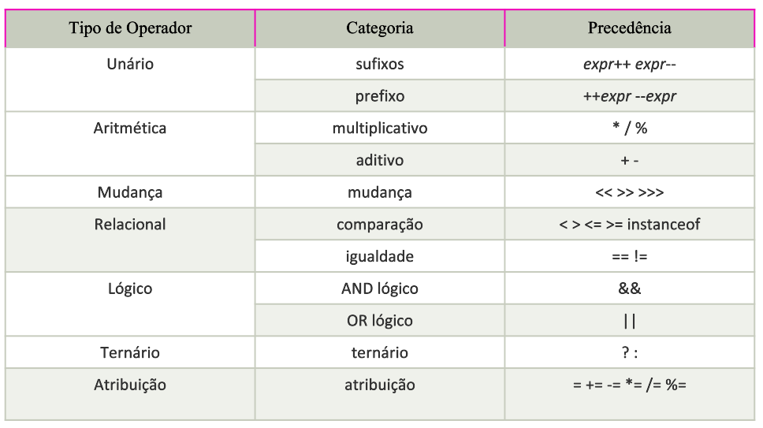

# Operadores

Operador em java é um símbolo usado para executar operações.

## Lógicos

Responsável por realizar operações lógicas, como **AND** e **OR**.

[Exemplo](/src/br/com/letscode/introducao/base/operadores/exemplos/Logicos.java)

## Relacionais

Responsável por realizar comparação entre valores.

[Exemplo](/src/br/com/letscode/introducao/base/operadores/exemplos/Relacionais.java)

## Aritimeticos

Operadores aritméticos são usados para executar: adição, subtração, multiplicação e divisão. Eles agem como operações
matemáticas básicas.

[Exemplo](/src/br/com/letscode/introducao/base/operadores/exemplos/Aritimeticos.java)

## Ternario

O operador ternário é usado como um substituto para a instrução if-then-else e muito usado na programação Java. É o
único operador condicional que leva três operandos.

a relacionai b ? "SIM" : "Não"

se a e b forem boolean:

a (operador lógico) b ? "SIM" : "Não"

[Exemplo: Ternario](/src/br/com/letscode/introducao/base/operadores/exemplos/Ternario.java)

[Exemplo: Ternario plus plus](/src/br/com/letscode/introducao/base/operadores/exercicios/TernarioPlusPlus.java)

# Bibliografia:

* https://www.javatpoint.com/pt/operadores-em-java
* https://www.devmedia.com.br/java-operadores-de-atribuicao-aritmeticos-relacionais-e-logicos/38289
