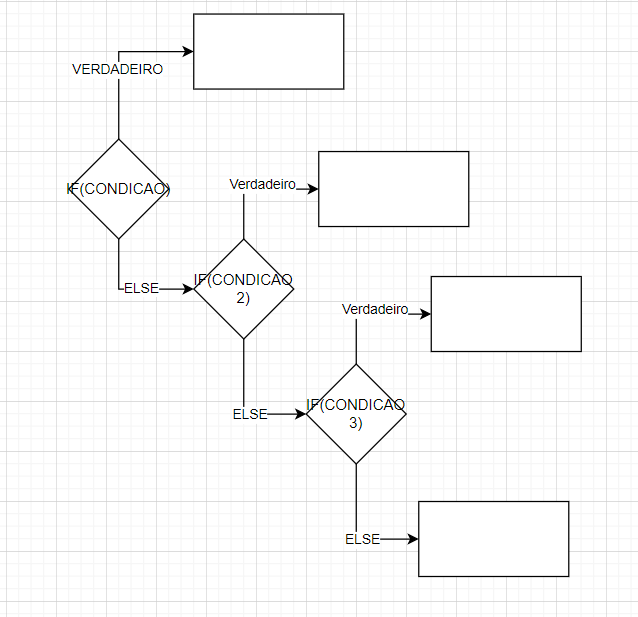

# if

Se a condição for verdadeira ele executa o código do laço

`if` - seguido de outro `if`

* Se a condição for verdadeira ele executa o código do laço.
* Se a condição for verdadeira ele executa o código do laço

`if` - `else if`

* Se a condição for verdadeira ele executa o código do laço.
* Se a condição for anterior for falsa e a atual verdadeira ele executa o código do laço

`if` `else`

* 
* Se a condição for verdadeira ele executa o código do if.
* Caso contrário executa o código dentro do else

[Exemplo](/src/br/com/letscode/introducao/base/fluxo/exemplos/CondicionalIf.java)

## Exercício:

Criar um programa que recebe 2 números e realiza a soma deles. Porém, nesse caso o programa deve observar quantos
parâmetros são enviados via terminal(args).

Se for nenhum, deve pedir via System.in que o usuário digite 2 números. No caso de vir apenas 1, deve pedir outro
parâmetro via System.in. Se for 2, deve realizar a soma dos dois.

No caso de qualquer outra quantidade. Deve apresentar uma mensagem de erro falando que a quantidade é inválida.

[Exercício](/src/br/com/letscode/introducao/base/fluxo/exercicios/SomaSimples.java)

# switch

[Exemplo](/src/br/com/letscode/introducao/base/fluxo/exemplos/CondicionalSwitch.java)

O `break` força a saída do condicional do `switch`. O que acontece se remover os breaks no exemplo anterior?

A estrutura switch permite variáveis dos tipos primitivos:

* byte
* short
* char
* int.

Também aceita a partir do Java 8:

* Enum
* String.

## Evolução

https://fullstackdeveloper.guru/2021/08/11/pattern-matching-for-switch-java-17/

Java 12 introduced a flurry of new features:

You can return values from a switch block and hence switch statements became switch expressions You can have multiple
values in a case label You can return value from a switch expression through the arrow operator or through the “break”
keyword Java 13 later introduced yield keyword to be used instead of break keyword for returning values.

All these are explained here with examples:

The evolution of switch statement

Java 17 , the latest Java version, has introduced a new feature for switch .

It is called pattern matching.

You can match patterns in a case label.

In other words you can pass objects in switch condition and this object can be checked for different types in switch
case labels.

# Exercício

Realizar uma operação matemática, que deve ser passada via System.in ( opções: + - / * ) entre dois números que também
devem ser solicitados via System.in

[Exercício](/src/br/com/letscode/introducao/base/fluxo/exercicios/Calculadora.java)

